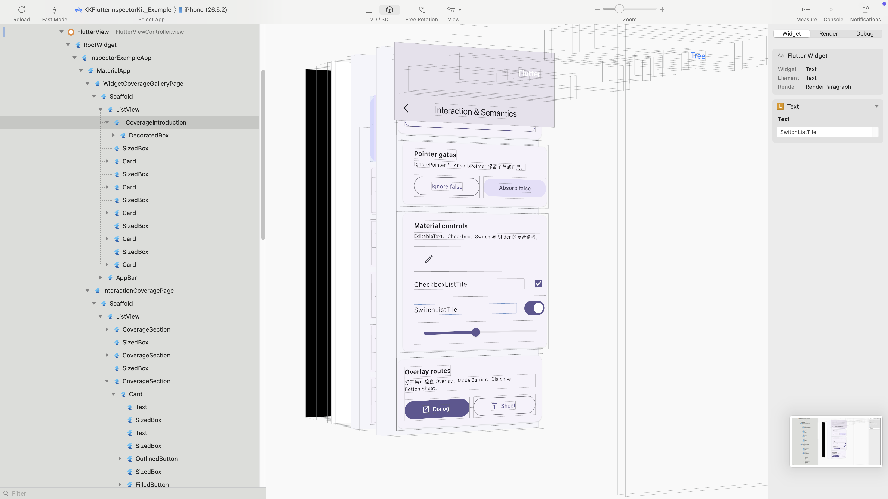

# KKFlutterInspectorKit

An Objective-C toolkit for inspecting Flutter pages embedded in an iOS app.

[中文](#中文) · [English](#english)



*PickView Mac 中的 Flutter Widget 层级、3D 视图与属性面板 / Flutter widget hierarchy, 3D view, and properties in PickView Mac.*

---

## 中文

### 它是做什么的

`KKFlutterInspectorKit` 运行在被检查的 iOS App 进程内，通过 Flutter VM Service 和 Flutter Inspector Service Extensions 读取已经嵌入 App 的 Flutter 页面。

它把 Flutter Inspector 返回的 Widget、RenderObject 和诊断数据整理成稳定的 Objective-C 模型，供 PickView 或其他 iOS 调试工具展示 Flutter 层级、属性和截图。

目前提供以下能力：

- 在指定 `UIWindow` 的 ViewController 层级中发现 `FlutterViewController` 和对应的 `FlutterEngine`。
- 按 `FlutterEngine` 复用 VM Service Session，避免每次请求都重新建立 WebSocket 连接。
- 获取 Flutter Widget/RenderObject 层级，包括节点类型、坐标、尺寸、文字预览和原始 Inspector JSON。
- 将 `Column`、`Row`、`Padding`、`Align` 等布局 Widget 整理为可展示的布局关系和节点属性，减少无意义的包装节点。
- 按 Widget runtime type 过滤节点；被过滤节点的子节点会提升到原父节点，不会丢失业务内容。
- 获取指定 Flutter Element 的完整 DiagnosticsNode 属性。
- 获取指定 Flutter Element 的 PNG 截图，并控制逻辑尺寸、margin、像素比例和 debug paint。
- 管理 Inspector `objectGroup` 和快照生命周期，防止在 isolate 或层级刷新后继续使用失效的 Element 引用。
- 支持一个 Window 中存在多个 Flutter 页面；可以明确指定要检查的 `FlutterViewController`。

### 不负责什么

- 不修改 Flutter Widget、属性或运行状态。
- 不提供完整的桌面端 Inspector UI；仓库中的 Example 仅用于演示 Kit 返回的数据。
- 不通过 MethodChannel 获取层级，也不要求业务 Flutter 代码额外注册 MethodChannel。
- 不支持没有 VM Service/Inspector Extensions 的 Flutter Release 运行环境。
- 当前 Pod 仅支持 iOS，不包含 macOS 实现。

### 工作流程

```text
UIWindow
  -> 查找 FlutterViewController / FlutterEngine
  -> 读取 vmServiceUrl 和 isolateId
  -> 建立并复用 VM Service WebSocket Session
  -> getRootWidgetTree + getLayoutExplorerNode
  -> 构建 KKFIHierarchySnapshot
  -> 按需 getProperties / screenshot
```

`warmUpWindow:` 只负责发现 Engine 和提前连接 Session，不会获取 Flutter Element 树。真正的层级请求由 `fetchHierarchy...` 发起。

### 环境要求

- iOS 13.0+
- UIKit
- Objective-C 或能够调用 Objective-C API 的 iOS 工程
- App 运行时已经嵌入 Flutter，并存在可见的 `FlutterViewController`
- Flutter Debug 运行环境，且 `FlutterEngine.vmServiceUrl`、`isolateId` 和 Inspector Service Extensions 可用

Kit 使用运行时发现 Flutter 类型；没有引入 `<Flutter/Flutter.h>` 时 Pod 仍然可以编译，但只有 App 实际集成并运行 Flutter 后才能获取层级。

### 安装

本地开发时：

```ruby
pod 'KKFlutterInspectorKit', :path => '../KKFlutterInspectorKit'
```

发布到 CocoaPods Specs 后可以使用版本依赖：

```ruby
pod 'KKFlutterInspectorKit', '~> 0.1'
```

然后执行：

```bash
pod install
```

### 快速使用

```objc
#import <Flutter/Flutter.h>
#import <KKFlutterInspectorKit/KKFlutterInspector.h>

@property(nonatomic, strong) KKFlutterInspector *flutterInspector;
```

创建 Inspector，并根据需要配置过滤类型：

```objc
self.flutterInspector = [[KKFlutterInspector alloc] init];
self.flutterInspector.excludedWidgetTypes = [NSSet setWithArray:@[
    @"RootWidget",
    @"MaterialApp",
]];
```

Flutter 页面显示后可以提前预热 Session：

```objc
- (void)viewDidAppear:(BOOL)animated {
    [super viewDidAppear:animated];
    if (self.view.window != nil) {
        [self.flutterInspector warmUpWindow:self.view.window];
    }
}
```

获取指定 Flutter 页面的层级：

```objc
CGSize rootSize = flutterViewController.view.bounds.size;
[self.flutterInspector
    fetchHierarchyForViewController:flutterViewController
                     fallbackRootSize:rootSize
                           completion:^(KKFIHierarchySnapshot *snapshot,
                                        NSError *error) {
    if (error != nil) {
        NSLog(@"Flutter hierarchy error: %@", error);
        return;
    }

    KKFIInspectorElement *root = snapshot.rootElement;
    NSLog(@"root widget: %@, children: %@",
          root.widgetType, @(root.children.count));

    dispatch_async(dispatch_get_main_queue(), ^{
        // 使用 snapshot 更新 UI。
    });
}];
```

如果 Window 中只有一个 Flutter 页面，也可以调用：

```objc
[self.flutterInspector fetchHierarchyInWindow:window
                              fallbackRootSize:window.bounds.size
                                    completion:^(KKFIHierarchySnapshot *snapshot,
                                                 NSError *error) {
    NSLog(@"snapshot: %@, error: %@", snapshot, error);
}];
```

### 获取节点属性

```objc
KKFIInspectorElement *element = snapshot.rootElement;
[self.flutterInspector
    fetchPropertiesForElement:element.reference
                   completion:^(NSArray<NSDictionary *> *properties,
                                NSError *error) {
    if (properties != nil) {
        NSLog(@"properties: %@", properties);
    }
}];
```

### 获取节点截图

```objc
KKFIScreenshotOptions *options =
    [[KKFIScreenshotOptions alloc] initWithLogicalSize:element.frame.size];
options.margin = 0;
options.maxPixelRatio = 2;
options.debugPaint = NO;

[self.flutterInspector
    captureScreenshotForElement:element.reference
                         options:options
                      completion:^(KKFIScreenshotResult *result,
                                   NSError *error) {
    UIImage *image = result.image;
    NSData *pngData = result.pngData;
}];
```

### 主要模型

| 类型 | 作用 |
| --- | --- |
| `KKFIHierarchySnapshot` | 一次 Flutter 层级请求的快照，包含 isolate、objectGroup 和根节点。 |
| `KKFIInspectorElement` | 可展示的 Flutter 节点，包含 Widget/RenderObject 类型、frame、布局关系、装饰信息和子节点。 |
| `KKFIElementReference` | 属性和截图请求使用的节点引用，只在所属快照仍然有效时可用。 |
| `KKFIScreenshotOptions` | 截图逻辑尺寸、margin、最大像素比例和 debug paint 配置。 |
| `KKFIScreenshotResult` | 解码后的 `UIImage`、原始 PNG Data 和像素尺寸。 |

### 快照和线程说明

- 层级、属性和截图回调运行在 Kit 的私有串行队列，不保证在主线程；更新 UIKit 时需要切回主线程。
- 同一个 Engine 的并发层级请求会合并到同一次 Inspector 请求。
- 同一个 Engine 获取新层级后，旧 `objectGroup` 会被释放，旧 `KKFIElementReference` 将返回失效错误。
- Hot Restart、Engine 替换或 isolate 变化后，Session 会废弃旧连接和旧快照，再建立当前连接。
- `fallbackRootSize` 只在 Inspector 没有提供完整根节点几何信息时使用。

### 运行 Example

```bash
cd Example/flutter_module
flutter pub get
cd ..
pod install
open KKFlutterInspectorKit.xcworkspace
```

使用 Debug 配置运行 Example，进入 Flutter 页面后点击右上角的 **Tree**，可以查看层级并进入节点详情页。

---

## English

### What it does

`KKFlutterInspectorKit` runs inside the inspected iOS application and reads Flutter pages already embedded in that process through the Flutter VM Service and Flutter Inspector Service Extensions.

It converts Widget, RenderObject, and diagnostic payloads into stable Objective-C models that PickView or another iOS debugging tool can use to present Flutter hierarchy, properties, and screenshots.

Current capabilities include:

- Discovering `FlutterViewController` and `FlutterEngine` instances attached to a specified `UIWindow`.
- Reusing one VM Service session per `FlutterEngine` instead of reconnecting for every request.
- Fetching a Widget/RenderObject hierarchy with node types, geometry, text previews, and raw Inspector JSON.
- Folding layout widgets such as `Column`, `Row`, `Padding`, and `Align` into layout relations and node properties to reduce wrapper-only hierarchy rows.
- Filtering nodes by Widget runtime type while promoting their children, so filtering a wrapper does not discard application content.
- Fetching complete DiagnosticsNode properties for a selected Flutter element.
- Capturing a selected Flutter element as PNG with logical size, margin, pixel ratio, and debug-paint options.
- Managing Inspector `objectGroup` and snapshot lifetime so stale element references are rejected after an isolate or hierarchy change.
- Supporting multiple Flutter pages in one window by allowing a specific `FlutterViewController` to be selected.

### What it does not do

- It does not modify Flutter widgets, properties, or runtime state.
- It does not provide a complete desktop Inspector UI; the Example only demonstrates the data returned by the Kit.
- It does not use MethodChannel and does not require application Flutter code to register a custom MethodChannel.
- It cannot inspect a Flutter Release runtime that does not expose VM Service and Inspector extensions.
- The current Pod supports iOS only; it does not include a macOS implementation.

### Runtime flow

```text
UIWindow
  -> discover FlutterViewController / FlutterEngine
  -> read vmServiceUrl and isolateId
  -> connect and reuse a VM Service WebSocket session
  -> getRootWidgetTree + getLayoutExplorerNode
  -> build KKFIHierarchySnapshot
  -> fetch getProperties / screenshot on demand
```

`warmUpWindow:` only discovers engines and starts reusable sessions. It never fetches an Element tree; hierarchy loading starts with one of the `fetchHierarchy...` methods.

### Requirements

- iOS 13.0+
- UIKit
- An Objective-C project, or an iOS project that can call Objective-C APIs
- An embedded and visible `FlutterViewController` at runtime
- A Flutter Debug runtime with an available `FlutterEngine.vmServiceUrl`, `isolateId`, and Inspector Service Extensions

The Kit discovers Flutter types at runtime. It can compile without importing `<Flutter/Flutter.h>`, but hierarchy inspection only works when the host application actually embeds and runs Flutter.

### Installation

For local development:

```ruby
pod 'KKFlutterInspectorKit', :path => '../KKFlutterInspectorKit'
```

After the Pod is published to a CocoaPods Specs repository:

```ruby
pod 'KKFlutterInspectorKit', '~> 0.1'
```

Then run:

```bash
pod install
```

### Quick start

```objc
#import <Flutter/Flutter.h>
#import <KKFlutterInspectorKit/KKFlutterInspector.h>

@property(nonatomic, strong) KKFlutterInspector *flutterInspector;
```

Create the inspector and optionally configure filtered Widget types:

```objc
self.flutterInspector = [[KKFlutterInspector alloc] init];
self.flutterInspector.excludedWidgetTypes = [NSSet setWithArray:@[
    @"RootWidget",
    @"MaterialApp",
]];
```

Warm the session after the Flutter page becomes visible:

```objc
- (void)viewDidAppear:(BOOL)animated {
    [super viewDidAppear:animated];
    if (self.view.window != nil) {
        [self.flutterInspector warmUpWindow:self.view.window];
    }
}
```

Fetch the hierarchy for a specific Flutter page:

```objc
CGSize rootSize = flutterViewController.view.bounds.size;
[self.flutterInspector
    fetchHierarchyForViewController:flutterViewController
                     fallbackRootSize:rootSize
                           completion:^(KKFIHierarchySnapshot *snapshot,
                                        NSError *error) {
    if (error != nil) {
        NSLog(@"Flutter hierarchy error: %@", error);
        return;
    }

    KKFIInspectorElement *root = snapshot.rootElement;
    NSLog(@"root widget: %@, children: %@",
          root.widgetType, @(root.children.count));

    dispatch_async(dispatch_get_main_queue(), ^{
        // Update UIKit with the snapshot.
    });
}];
```

When a window contains only one Flutter page, use:

```objc
[self.flutterInspector fetchHierarchyInWindow:window
                              fallbackRootSize:window.bounds.size
                                    completion:^(KKFIHierarchySnapshot *snapshot,
                                                 NSError *error) {
    NSLog(@"snapshot: %@, error: %@", snapshot, error);
}];
```

### Fetching element properties

```objc
KKFIInspectorElement *element = snapshot.rootElement;
[self.flutterInspector
    fetchPropertiesForElement:element.reference
                   completion:^(NSArray<NSDictionary *> *properties,
                                NSError *error) {
    if (properties != nil) {
        NSLog(@"properties: %@", properties);
    }
}];
```

### Capturing an element screenshot

```objc
KKFIScreenshotOptions *options =
    [[KKFIScreenshotOptions alloc] initWithLogicalSize:element.frame.size];
options.margin = 0;
options.maxPixelRatio = 2;
options.debugPaint = NO;

[self.flutterInspector
    captureScreenshotForElement:element.reference
                         options:options
                      completion:^(KKFIScreenshotResult *result,
                                   NSError *error) {
    UIImage *image = result.image;
    NSData *pngData = result.pngData;
}];
```

### Main models

| Type | Purpose |
| --- | --- |
| `KKFIHierarchySnapshot` | One hierarchy snapshot containing its isolate, object group, and root element. |
| `KKFIInspectorElement` | A presentable Flutter node containing Widget/RenderObject types, frame, layout relations, decoration metadata, and children. |
| `KKFIElementReference` | The reference used by property and screenshot requests; valid only while its snapshot remains active. |
| `KKFIScreenshotOptions` | Logical size, margin, maximum pixel ratio, and debug-paint configuration. |
| `KKFIScreenshotResult` | The decoded `UIImage`, original PNG data, and pixel size. |

### Snapshot and threading notes

- Hierarchy, property, and screenshot completions run on a private serial queue and are not guaranteed to run on the main thread. Dispatch to the main thread before updating UIKit.
- Concurrent hierarchy callers for the same engine are coalesced into one Inspector request.
- Fetching a new hierarchy for an engine disposes its previous `objectGroup`; old `KKFIElementReference` instances then return a stale-reference error.
- After a Hot Restart, engine replacement, or isolate change, the session retires its previous connection and snapshot before connecting to the current runtime.
- `fallbackRootSize` is used only when the Inspector payload does not contain complete root geometry.

### Running the Example

```bash
cd Example/flutter_module
flutter pub get
cd ..
pod install
open KKFlutterInspectorKit.xcworkspace
```

Run the Example with the Debug configuration, open its Flutter page, and tap **Tree** in the navigation bar to inspect the hierarchy and open node details.

---

## Author

kriskice9527@gmail.com

## License

KKFlutterInspectorKit is available under the MIT license. See [LICENSE](LICENSE) for details.
